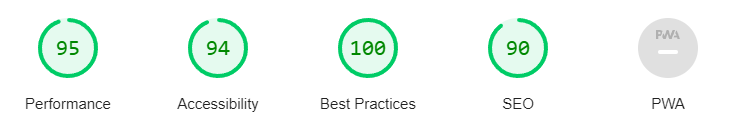

### 웹 포트폴리오입니다.

제 웹 포트폴리오는 항상 진행 중에 있습니다. 진행상황을 보시려면 <a href="https://introduce-murex.vercel.app">이곳</a>을 클릭하세요.

# 세부사항

## 파일 체계

```
Root
|—app
|——components
|———common: 재사용될 수 있는 요소에 대한 정의가 위치합니다.
|———feature: 특정 페이지에서만 사용될 요소에 대한 정의가 위치합니다.
|—styles: SCSS 파일이 위치합니다.
```

### 기술


<a href="https://minimamente.com/project/magic">MAGIC LIBRARY</a>


### 눈여겨 보아야할 점들

- 재사용 가능한 에니메이션 요소가 정의되어있습니다.
- 프롭스를 통해 모든 요소를 유연하고 적절하게 수정/통제할 수 있습니다.
- 파이어베이스를 통해 페이지의 사용자에 대한 정보를 수집합니다.
- 디자인 체계를 적용해 프로페셔널한 UI/UX와 각 요소의 조화를 구성했습니다.
- Three.js API 통해서 WebGL을 간단하게 사용해보았습니다. (최적화를 위해 이를 비디오 포맷으로 변경할 수도 있습니다.)
### 벤치마크
